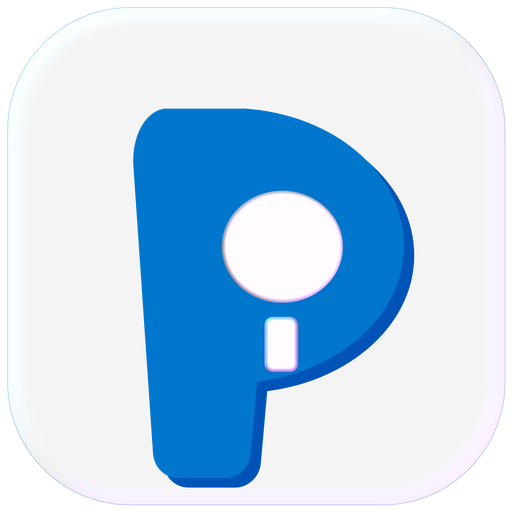

<p align="center">
  
</p>

<h1 align="center">ID Plan · 室内设计项目节点管理系统</h1>

<p align="center">
  <strong>把项目拆解成一张看得懂的阶段时间轴 —— 离线优先的室内设计项目管理工具。</strong>
</p>

> ID Plan 是给室内设计师（个人 / 工作室）用的项目排程工具。把项目的金额、类型、阶段节点、参与成员整理成一张清爽的时间轴，用看板、日历、甘特图三种视角随时掌握进度，并把排期导成给甲方看的专业交付页。

---

## ✨ 功能亮点

### 📋 项目全流程管理
- **三步建档** — 新建项目时选模板（室内/建筑/景观）、填金额、配阶段，一条时间轴即刻生成
- **阶段自定义** — 多类项目模板，阶段占比、时长、参与成员灵活配置，适配不同项目节奏
- **三大视图** — 四列看板（待启动/设计中/深化中/施工中）、月历视图、可拖拽改期的甘特时间轴

### 👥 多人协同
- **任务指派** — 任务可指派多个成员，任何参与人都可勾选完成，进度实时同步
- **角色权限** — 管理员（设计师本人）看全貌；普通成员只看自己相关的项目与任务
- **成员看板** — 每位成员登录后，看到的是**自己相关的项目**进度，一眼聚焦本职
- **密码登录** — 管理员可为每个成员单独设/清密码，有密码成员需验证后才可进入

### 🗓️ 排期与交付
- **休息制度** — 大休/小休、单休/双休可配置，排期自动跳过休息日，竣工日期准确
- **打印 / 导出** — 日程表 A4 打印视图、导出 PNG 高清图，发给甲方也专业
- **双主题** — 亮 / 暗 / 跟随系统三态，Soft UI 磨砂玻璃质感
- **备份恢复** — 一键导出/导入 JSON 备份，数据格式全量校验，迁移无压力

---

## 🖥️ 支持平台

| 平台 | 方式 | 说明 |
|------|------|------|
| **Windows** | 桌面版安装包 | 独立桌面应用，数据存本机，适合个人使用 |
| **绿联 NAS** | UPK 应用包 / Docker | 数据集中存 NAS，团队共享 |
| **浏览器** | 访问 NAS Docker 版 | **Mac** / 手机都能通过浏览器访问 NAS 上部署的版本 |

> **关于 Mac**：我们没有发布 Mac 原生安装包。Mac 用户请部署 **绿联 NAS 上的 Docker 版**，然后用浏览器访问 `http://<NAS的IP>:28080` 即可使用（这与 Windows 用浏览器访问 NAS 的方式一致）。

---

## 🚀 安装方式（三选一）

### 方式一：Windows 桌面版（推荐个人使用）

下载 Windows 安装包，双击即装，桌面 + 开始菜单生成「ID Plan」快捷方式。数据存在**本机**。

- 📄 **详细步骤**：[docs/install/windows-install.md](docs/install/windows-install.md)
- 💿 **下载**：见下方「📦 下载地址」的 `IDPlan-0.3.0-Setup.exe`

> 无代码签名证书，Windows SmartScreen 可能提示「未知发布者」→ 点**更多信息** → **仍要运行**。

### 方式二：绿联 NAS 部署（推荐团队共享）

团队的数据集中存在 **NAS** 上，所有人自动看到同一份，不用手动导 JSON。**只需要一台绿联 NAS（UGOS Pro 系统）+ 一个浏览器**，不需要装任何 Docker 工具。有两种装法：

- 📦 **UPK 应用包**（推荐，最省事）：一个包内含前后端，应用中心手动安装。👉 [docs/install/upk-install-tutorial.md](docs/install/upk-install-tutorial.md)
- ⚙️ **Docker compose**（手动配容器）：👉 [docs/install/nas-deploy-tutorial.md](docs/install/nas-deploy-tutorial.md) · 配置文件 [docs/install/idplan-nas-compose.yml](docs/install/idplan-nas-compose.yml)

部署完成后，Windows / Mac / 手机都能用浏览器访问 `http://<NAS的IP>:28080`。

### 方式三：Docker（通用 / 自建服务器）

项目是 **前端 + 后端** 分离架构，两个镜像可从 ghcr 拉取：

```bash
# 前端（nginx 托管页面 + /api 反代）
ghcr.io/chengcheng067/idplan:0.3.0
# 后端（Fastify + SQLite，团队共享数据层）
ghcr.io/chengcheng067/idplan-backend:0.3.0
```

用 [docs/install/idplan-nas-compose.yml](docs/install/idplan-nas-compose.yml) 一键编排，或按需修改升级。

---

## 📦 下载地址

### 最新发布（v0.3.0 · 构建号 .0018）

| 平台 | 文件 | 用途 |
|------|------|------|
| **Windows** | `IDPlan-0.3.0-Setup.exe` | 桌面安装，个人使用 |
| **绿联 NAS (amd64)** | `amd64_com.chengcheng.idplan_0.3.0.0018.upk` | UGOS Pro 手动导入 |
| **Docker 镜像 (.tar)** | `idplan-amd64.tar` / `idplan-backend-amd64.tar` | 离线导入 / 自建 |

> 🤖 所有发布产物（exe / upk / tar / compose）都挂在 GitHub **Releases** 页：
> 👉 **https://github.com/chengcheng067/idplan/releases**

按你的架构选择：绝大多数 Intel 系 NAS 用 **amd64**；arm64 仅 Apple Silicon / 部分 ARM 机型。

---

## 🛠️ 技术栈

| 层 | 技术 |
|---|------|
| 前端框架 | Vite 5 + React 18 + TypeScript 5 |
| 状态管理 | Zustand |
| 本地存储 | Dexie（IndexedDB） |
| 样式 | Tailwind CSS 3 + Soft UI |
| 服务端 | Fastify + SQLite（团队共享数据层） |
| 测试 | Vitest + fake-indexeddb |
| 打包 | electron-builder → NSIS Setup（Windows） / 绿联 UPK |

### 本地开发

```bash
npm install
npm run dev          # http://localhost:5173
npm test             # 全量单测
npm run build        # 类型检查 + 构建
```

> 数据源切换：`.env.local` 里 `VITE_DATA_SOURCE=local`（本地 IndexedDB，默认）或 `remote`（NAS 后端，多端同步）。切换是进程启动时定型，改完需重启。

---

## 📖 文档

- 🪟 **Windows 版安装**：[docs/install/windows-install.md](docs/install/windows-install.md)
- 📦 **绿联 NAS · UPK 应用包**：[docs/install/upk-install-tutorial.md](docs/install/upk-install-tutorial.md)
- ⚙️ **绿联 NAS · Docker compose**：[docs/install/nas-deploy-tutorial.md](docs/install/nas-deploy-tutorial.md) · [idplan-nas-compose.yml](docs/install/idplan-nas-compose.yml)
- 🗂️ **备份格式**：[docs/backup-format.md](docs/backup-format.md)
- 🤖 **发布产物**：见 GitHub [Releases](https://github.com/chengcheng067/idplan/releases)

---

## 🤝 如何参与共创

ID Plan 从一开始就是为真实需求而生的。无论你是设计师、开发者还是行业专家，都可以贡献你的力量：

- **反馈功能 / 提 Bug** — 提 Issue 或直接 PR
- **补充项目模板** — 如果你熟悉某个行业（酒店/餐饮/办公等），提交模板 PR
- **改进交互 / 视觉** — UI 文案、操作路径、图标优化
- **贡献代码** — 用 vitest 写测试，简单友好

---

## ⚖️ 许可

本项目采用 [MIT License](LICENSE)。

---

## 💬 写在最后

这个项目始于一个简单的想法：**设计师不应该在项目管理上浪费时间。**

我的设计师朋友丞丞说，每次做项目，光是记阶段节点、排工期、跟成员对齐进度就耗掉大半天。于是我们决定做一个工具——把项目的阶段、任务、成员、排期放在一个地方，让进度管理在同一次操作中完成，还能一键导出给甲方看。

如果你有类似的需求，或者对这个项目有任何想法，欢迎提 Issue 或 PR。我们一起让它变得更好。

> **ID Plan — 阶段清晰，进度可见。**

---

© 2026 ChengCheng · [GitHub](https://github.com/chengcheng067/idplan)
